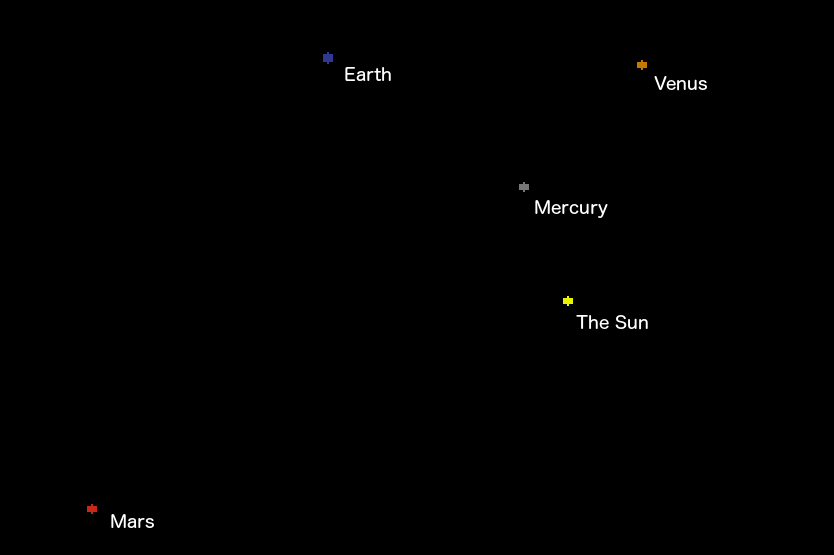

# Trajectory

A 3d solar system simulator written in C, using SDL for rendering.

### About:

Trajectory is a solar system simulator, written in C. The physics is fully simulated in 3D, although the renderer is (currently) a top-down 2d view. Updates are calculated every thousand simulated seconds (every 17 minutes), which offers high precision while still remaining easy to calculate. All integration is handled using the 4th order Runge-Kutta, which minimizes error over long periods of time. The passage of time can be sped up and slowed down, making it just as easy to watch a close encounter between bodies as it happen as watching a thousand years pass by a second.

### Building:

To build, simply run `make`. Run the resulting `trajectory` executable.

### Dependencies:
 Trajectory needs the `SDL2`, `SDL2_gfx`, and `sqlite3` libraries installed. If you don't have them, you can download them with your package manager:

 `brew install SDL2 SDL2_gfx libconfig` (on OSX)

 `sudo apt install SDL2 SDL2_gfx libconfig` (on Debian Linux)

 If the libraries are installed somewhere other than /usr/lib or /usr/local/lib, edit the main Makefile to point to them.

#### Building on Windows:

 I've never tried to build this on Windows, but it doesn't rely on any POSIX functionality and all the needed libraries are cross platform—meaning it should be possible to build without MinGW or Cygwin.

### Controls:

#### Focusing:
When the solar system first opens, Trajectory will try to have every planet on the screen. To focus on a specific planet, click on it. That body will remain stationary at the center of the screen, while all the other bodies move around it. Try focusing on the earth—it's pretty cool.
#### Zooming:
Use the scroll wheel/trackpad to zoom in and out
#### Changing the passage of time:
By default, the system is paused. Hold the `.`(period) button to speed up the passage of time, and the `,`(comma) button to slow it down.

### Custom solar systems:

Solar systems are loaded via sqlite. Use the `SolarSystem.sqlite3` as an example.

### TODO:
* Add a simple 3d renderer (probably still using SDL)
* Add tools to change orbits in-game
* Implement variable timesteps—bodies with lots of acceleration get updated frequently, while far-flung bodies only get updated rarely.
* Parallelize the gravity calculations
